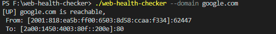
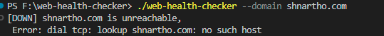

# Web Health Checker

**web-health-checker** is a simple command-line application built in **Golang** that checks whether a website is up or down. It allows you to specify a domain to check, and optionally, a port number to check.


## Overview

To use the Healthchecker CLI application, follow these steps:

1. Make sure you have Go installed on your system.

2. Clone this repository or download the source code.

3. Open a terminal and navigate to the directory containing the `main.go` file.

4. Build the application by running the following command:

   ```bash
   go build -o healthchecker
Run the healthchecker executable with the domain and, optionally, the port you want to check:

   ```bash
   ./healthchecker --domain example.com
```
You can also specify the port as follows:

   ```bash
   ./healthchecker --domain example.com --port 80
```
The application will check the specified website and display whether it is up or down.

##### UP


##### DOWN 

